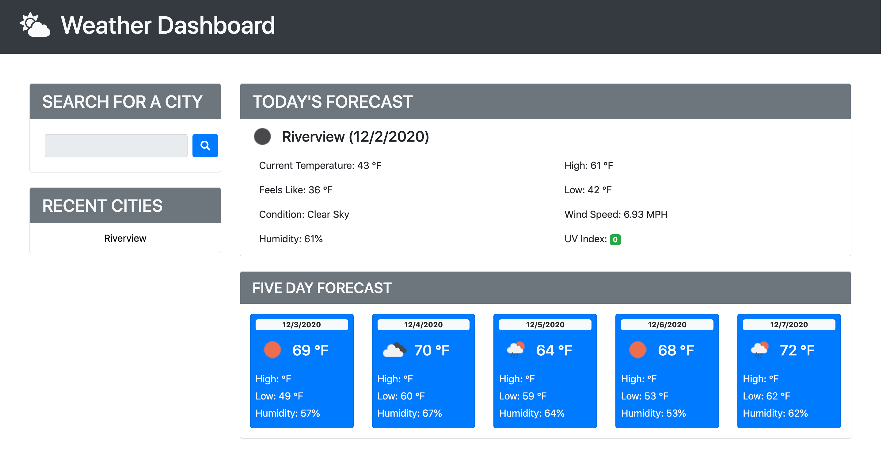

# Weather Dashboard

## Purpose
As a traveler users can see the weather outlook for multiple cities so that they can plan a trip accordingly.

## Contents
1. [Features](#features)
2. [Built With](#built-with)
3. [Web Page Mockup](#web-page-mockup)
4. [Contribution](#contribution)

## Features
* **PLEASE NOTE:** The API key is not included in the script.  Therefore, the application will not function for testing. Please contact Ruben Matamoros for the API key.
* Has a weather dashboard with form inputs to search for a city.
* On click they're presented with current and future conditions for that city and that city is added to the search history.
* Users are presented with the city name, the date, an icon representation of weather conditions, the temperature, the humidity, the wind speed, and the UV index.
* Colors indicate whether the conditions are favorable, moderate, or severe.
* A 5-day forecast displays the date, an icon representation of weather conditions, the temperature, and the humidity.

## Built With
* HTML5
* JavaScript 
* CSS3
* BootStrap 4
* Moment.js

## Web Page Mockup

[Deployed Website](https://valiantcreative33.github.io/weather-dashboard/)

## Contribution
* The API to retireve weather data for cities was provided by [OpenWeather API](https://openweathermap.org/api).
* Header icon provided by [Font Awesome](https://fontawesome.com/).
* Everything else was built with lots of growing pains and caffeine by Ruben Matamoros.